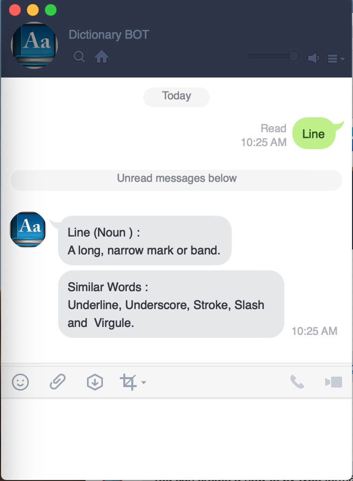

## Sample Dictionary Application

This application is show you. how integrate LINE Bot and Oxford Dictionary API.

### Prerequisite

1. LINE BOT Trial account from [https://developers.line.me/en/](https://developers.line.me/en/).The parameters that we need from this step as below.
     * `channel-token` . This is a channel token value of LINE bot account.
     * `channel-secret`. A channel secret value of LINE bot account.
2. Oxford Dictionary Account from [https://developer.oxforddictionaries.com/sign-in](https://developer.oxforddictionaries.com/sign-in). The parameters that we need are.
    * `oxford_base_url`. An endpoint URL to connect to the Oxford Dictionary API.
    * `app_id`. A Application Id of Oxford Dictionary account.
    * `app_key` A Application Key of Oxford Dictionary account.
3. Ngrok Account [https://dashboard.ngrok.com/user/signup](https://dashboard.ngrok.com/user/signup) and Download Ngrok here [https://ngrok.com/download](https://ngrok.com/download).
You can find more detail [https://ngrok.com/docs](https://ngrok.com/docs).
To integration test with LINE bot is require `HTTPS` So, we use Narok is handle `HTTPS` on local environment.

### Installing
A step by step series of examples that tell you how to get a development env running
##### 1. Down load the source code
```git
git clone git@github.com:boonkuaeb/oxford-dictionary.git dictionary
```
##### 2. Edit application configuration files
Open the `src/main/resources/application.yml` find with your favorite editor.
Replace contain of `application.yml` file as a table below.

| Parameter Name        | Definition|
| ------------- |:-------------:|
| ${DEVTOOLS_IS_DEV_MODE}      |  `true` for development env, `false` for production environment |
| ${LINE_BOT_CHANNEL_TOKEN}      | Replace this value as a `chanel-token` from the Prerequisite  step |
| ${LINE_BOT_CHANNEL_SECRET} | Replace this value as a `chanel-secret` from the Prerequisite  step     |
| ${OXFORD_BASE_URL} | Replace this value as a `oxford_base_url` from the Prerequisite  step     |
| ${OXFORD_APP_ID} | Replace this value as a `app_id` from the Prerequisite  step      |
| ${OXFORD_APP_KEY} | Replace this value as a `app_key` from the Prerequisite  step       |

##### 3. Unit Test
```bash
mvn clean test
```

##### 4. Integration Test
1. Handle `HTTPS`
    * Run `./ngrok http 8080`
    * Find the `https` url that Ngrok generated. For example `https://random-url.ngrok.io`
2. Update LINE Bot a Webhook URL
    * Go to [https://developers.line.biz/console/](https://developers.line.biz/console/)
    * Select the provider that registered form Prerequisite step
    * Select Channel Tab.
    * Update the Webhook URL with this pattern `https url` + `callback`. In this case you I use `https://random-url.ngrok.io/callback`
   
3. Add The line channel to your LINE application 
    * Go to [https://developers.line.biz/console/](https://developers.line.biz/console/)
    * Select the provider that registered form Prerequisite step
    * Select Channel Tab.
    * Find the QR code image
    * Open LINE application on your mobile phone. 
    * Add new friend via QR code.
    * Check a Friends list on LINE application. You will see new friend name `Dictionaty BOT`
    
4. Test
    * Input message text : `LINE`
    * Result: 
      


```
mvn package -DskipTests=true docker:build -Dtodo-profile=default

```


```docker
docker run --name dictionary-default -p8080:8080  -d dictionary-img-default

```

